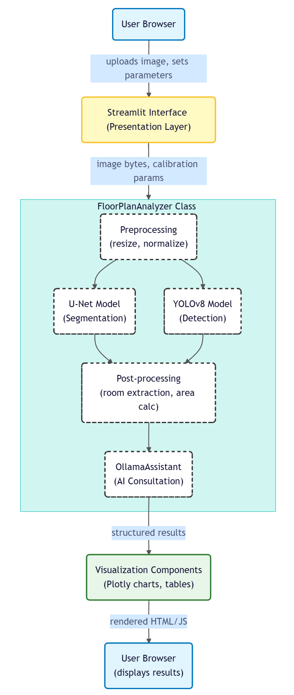
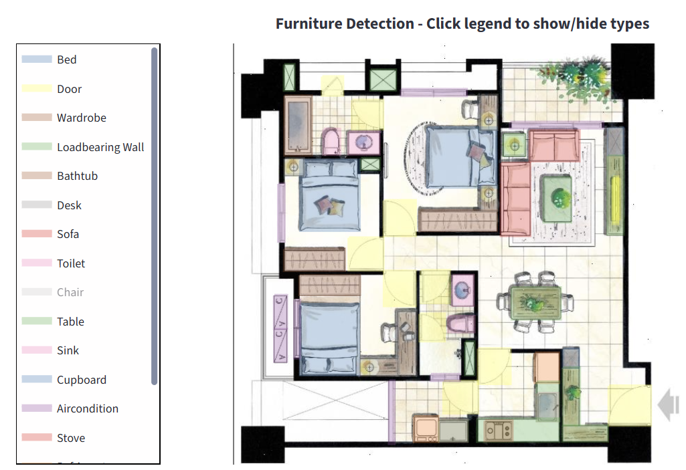
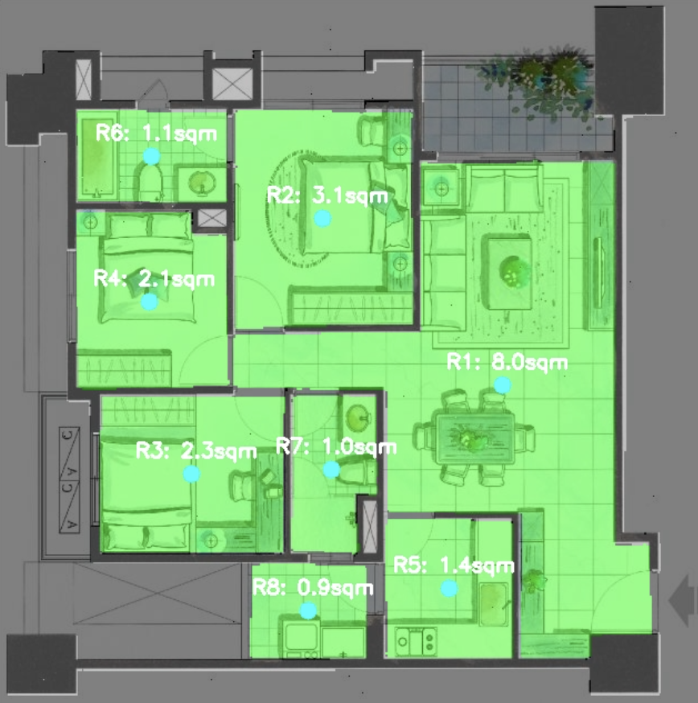
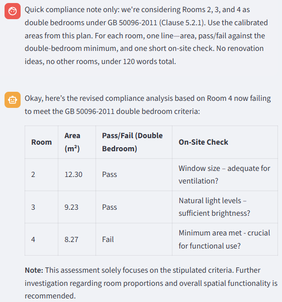
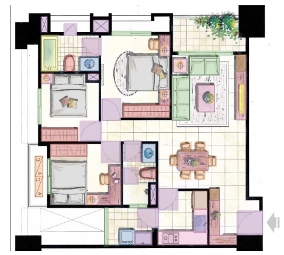
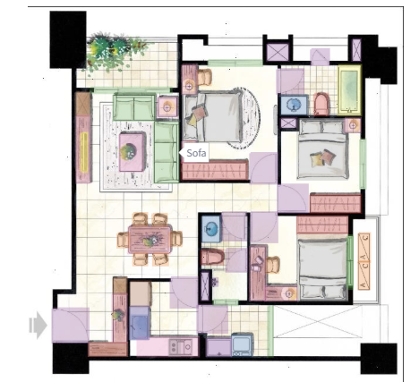
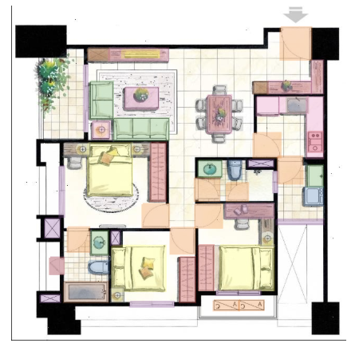
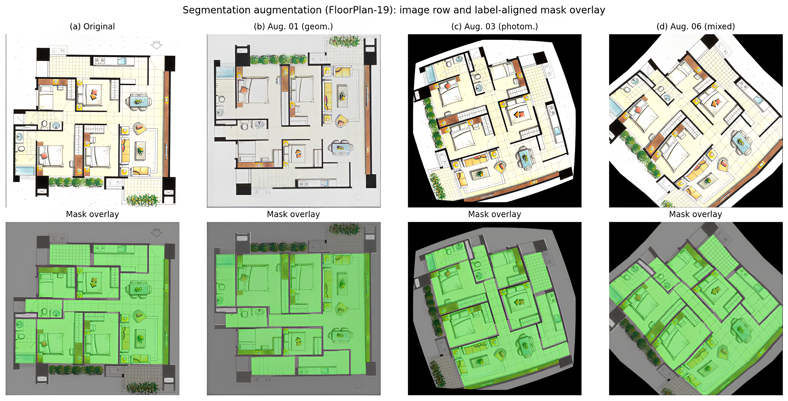
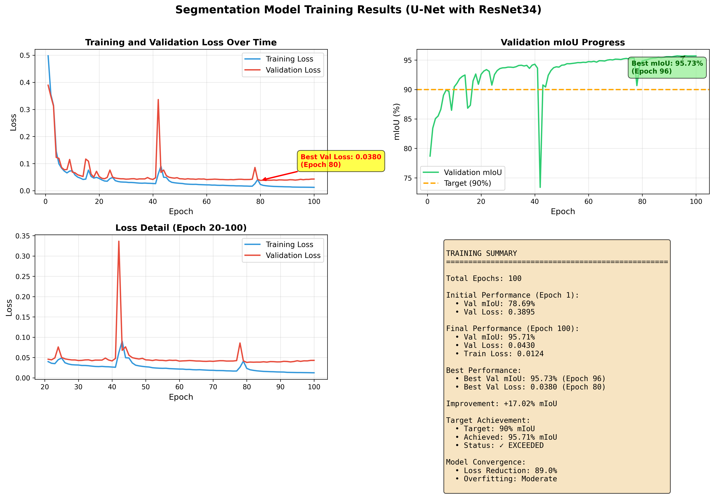

# LLM-Integrated Floor Plan Analysis System

An end-to-end pipeline for **existing building** floor plans: YOLOv8 symbol detection, U-Net room/wall segmentation, interactive scale calibration, and a local LLM assistant (Ollama) for advisory compliance screening. Delivered as a **Streamlit web app** plus reproducible training and evaluation scripts.



---

## Features

| Module | Description |
|--------|-------------|
| **Object detection** | 18 furniture/fixture classes (door, window, bed, sofa, etc.) via YOLOv8-nano |
| **Semantic segmentation** | Wall / room masks via ResNet34-U-Net (3-class deployment head) |
| **Area estimation** | User-defined scale in the sidebar (reference pixels + real length in cm) → m² per room |
| **AI assistant** | Local Ollama chat grounded on structured vision outputs (counts, areas, room list) |
| **CLI agent** | `src/agent/floorplan_agent.py` — batch analysis without the web UI |

**Detection (demo plan)**



**Segmentation & calibrated areas**



**LLM compliance screening (advisory)**



---

## Requirements

- **OS:** Windows 10/11 (batch scripts provided; Linux/macOS work with equivalent commands)
- **Python:** 3.10+ recommended
- **GPU:** Optional but recommended for training and faster inference (CUDA)
- **Ollama:** Optional, for the AI Assistant tab ([install](https://ollama.com))

---

## Deployment (Web App)

### 1. Clone and set up the environment

```powershell
cd FYP-Floorplan
setup_venv.bat
```

This creates `venv/` and installs dependencies from `requirements.txt`.

### 2. Place trained weights

The app expects:

| Model | Default path |
|-------|----------------|
| YOLOv8 detection | `runs/detect/train_90/weights/best.pt` |
| U-Net segmentation | `models/segmentation/best_model.pth` |

Train your own (see [Training](#training)) or copy checkpoints into these paths.

### 3. Start the web application

```powershell
start_web_app.bat
```

Open **http://localhost:8501**. Upload a floor plan, set **Reference Length (pixels)** and **Actual Length (cm)** in the sidebar, then run analysis.

### 4. (Optional) Enable the AI Assistant

1. Install [Ollama](https://ollama.com) and pull a model, e.g. `ollama pull gemma3`
2. Start Ollama (system tray or `ollama serve`)
3. If you see GPU/CUDA crashes, use CPU mode instead:

```powershell
start_ollama_cpu.bat
```

4. In the app, open the **AI Assistant** tab, select an installed model, and chat after running an analysis.

---

## Training

### Detection (YOLOv8)

```powershell
venv\Scripts\activate
python src/detection/train_detection.py --config config/furniture_detection.yaml --epochs 100
```

Dataset config: `data/train_90/data.yaml` (18 classes, train/val split under `data/train_90/`).

### Segmentation (U-Net)

```powershell
python scripts/train_segmentation_improved.py ^
  --images data/labels_segmentation/images ^
  --masks data/labels_segmentation/masks ^
  --epochs 100 --encoder resnet34
```

Checkpoint saved to `models/segmentation/best_model.pth` by default.

### Data augmentation

| Task | Script | Output |
|------|--------|--------|
| Detection (flip / 90° rotate) | `scripts/generate_augmented_dataset.py` | Augmented YOLO labels |
| Segmentation (Albumentations) | `scripts/augment_segmentation_data.py` | `data/segmentation_augmented/` |





Offline segmentation augmentation pipeline:



---

## Experiments & Evaluation

Scripts under `scripts/` reproduce the paper’s quantitative comparisons. Details: [`scripts/README_Baseline_Comparison.md`](scripts/README_Baseline_Comparison.md).

### In-domain baselines

**Segmentation — U-Net vs DeepLabv3+** (matched split, 100 epochs, ResNet34):

```powershell
python scripts/compare_segmentation_baselines.py ^
  --images data/segmentation_augmented/images ^
  --masks data/segmentation_augmented/masks ^
  --epochs 100 --architectures unet deeplabv3plus
```

→ `models/baseline_comparison/segmentation_results.json`

**Detection — YOLOv8 vs Faster R-CNN**:

```powershell
python scripts/compare_detection_baselines.py ^
  --data-yaml data/train_90/data.yaml ^
  --epochs 100 --models yolov8 fasterrcnn
```

Or run Faster R-CNN only: `run_frcnn_baseline.bat`  
→ `models/baseline_comparison/detection_results.json`

Reported validation metrics (paper): **92.3% mAP50** (YOLOv8), **95.71% mIoU** (U-Net).

### Training curves



High-resolution version: `results/segmentation_training_results_highres.png`

### Area validation (internal consistency)

Validates **predicted vs annotated masks** under the **same** user scale — not independent blueprint ground truth.

```powershell
run_area_validation.bat
```

→ `models/area_validation/results.json`  
See [`scripts/README_Area_Validation.md`](scripts/README_Area_Validation.md).

### Cross-dataset (CubiCasa5K)

Download [CubiCasa5K](https://zenodo.org/record/2613548), map labels to the 5-class schema, then fine-tune via `compare_segmentation_baselines.py` (see baseline README).

### Quick model smoke tests

```powershell
python scripts/test_detection_model.py
python scripts/test_segmentation_model.py
python test_model.py
```

---

## Project Structure

```
FYP-Floorplan/
├── app.py                      # Streamlit web application
├── src/
│   ├── detection/              # YOLO training & inference
│   ├── segmentation/           # U-Net training & inference
│   ├── agent/                  # Unified CLI agent
│   └── utils/                  # Area calculator, dataset helpers
├── scripts/                    # Augmentation, baselines, validation
├── config/                     # YOLO & segmentation YAML configs
├── data/
│   ├── train_90/               # Detection train/val images & labels
│   ├── labels_segmentation/    # Segmentation images & masks
│   └── segmentation_augmented/ # Offline augmented segmentation corpus
├── models/                     # Checkpoints & experiment JSON outputs
├── results/                    # Figures, demos, training plots
├── figures/                    # Paper figures (copy from results/ if needed)
├── requirements.txt
├── setup_venv.bat
├── start_web_app.bat
└── start_ollama_cpu.bat
```

---

## Results Folder

`results/` holds demo outputs and paper-ready figures:

| File | Content |
|------|---------|
| `architecture.png` | End-to-end pipeline diagram |
| `Object.png` / `Segmentation.png` / `LLM.png` | Web app screenshots |
| `origin.png`, `augmentation1.png`, `augmentation2.png` | Detection augmentation |
| `seg_augmentation.png` | Segmentation augmentation grid |
| `segmentation_training_results*.png` | Loss / mIoU curves |
| `complete_analysis.jpg`, `*_complete_analysis.jpg` | Full pipeline overlays |
| `improved_segmentation_test.jpg`, `test_segmentation_result.jpg` | Segmentation QA |

---

## Key Notes

- **Scale calibration:** Absolute m² depends on the operator’s reference length; changing the scale updates all reported areas. This is intentional workflow behavior, not blueprint verification.
- **LLM output:** Advisory only — not a substitute for licensed architectural or code-compliance review.
- **Privacy:** Vision + LLM run locally; floor plans are not sent to a cloud API when using Ollama on localhost.

---

## Documentation

- [`docs/TUTORIAL_01_数据标注指南.md`](docs/TUTORIAL_01_数据标注指南.md) — Annotation workflow (LabelImg / LabelMe)
- [`docs/TUTORIAL_02_模型训练.md`](docs/TUTORIAL_02_模型训练.md) — Training walkthrough
- [`scripts/README_Auto_Annotation.md`](scripts/README_Auto_Annotation.md) — Semi-automatic label generation
- [`scripts/README_Quick_Start_Data_Augmentation.md`](scripts/README_Quick_Start_Data_Augmentation.md) — Augmentation quick start

---

## License & Citation

Final-year project (FYP), Macao Polytechnic University.  
If you use this work, please cite the associated Applied Sciences publication (LLM-Integrated Semantic Deep Learning Framework for Automated Floor Plan Analysis, Area Estimation, and Compliance Assessment of Existing Buildings).
